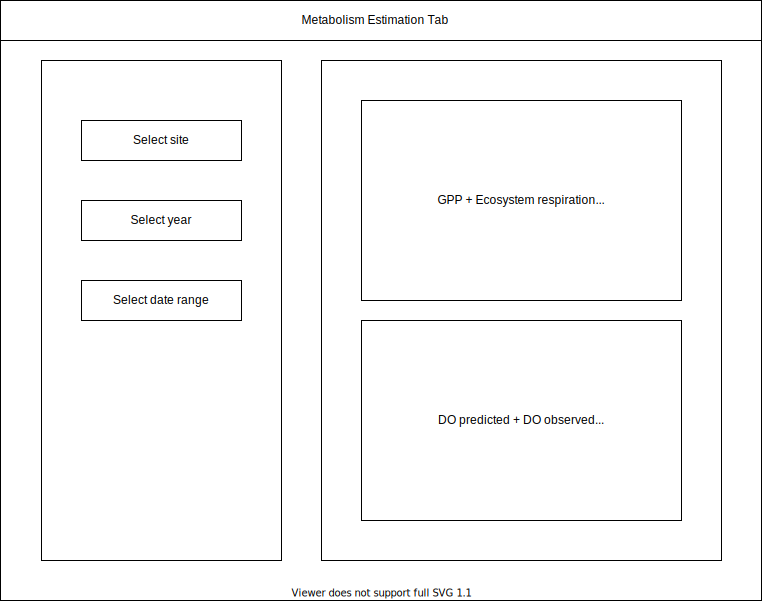

# swan.canning.dashboard

## To do
- Metabolism estimation tab
  - Timeseries plots
    - GPP + Ecosystem Respiration (+CI) multiline plot
      - Two lines on one plot
    - DO predicted + DO observed
      - Two lines on one plot
    - Optional: add temperature and solar radiation lines to plot
  - Cloud plot of GPP and ER
    - Optional: add K600 to plot

-   Visulisation tab
    -   WQ variable timeseries plots
        -   DO
        -   Salinity
        -   DO_sat
        -   Temperature
        -   Turbidity
        -   Specific conductivity
        -   Chlorophyl A
        -   fDOM
    -   Weather timeseries plots
        -   Rainfall
        -   Solar radiation
        -   Air temperature
        -   Relative humidity
        -   Wind speed (wind rose and/or timeseries)
    -   Tide timeseries plots
        -   Water height
    -   