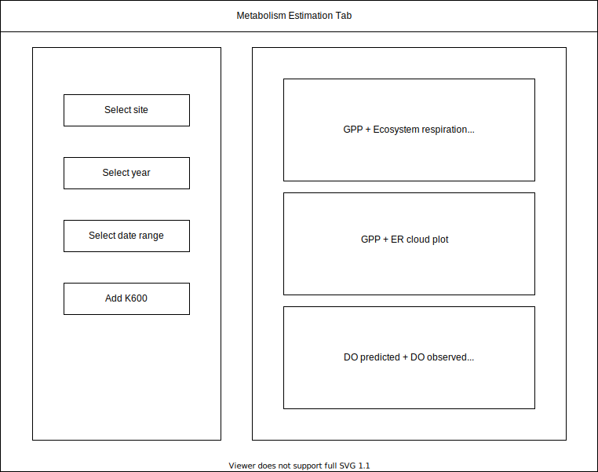

# swan.canning.dashboard

## To do:

### Database 

### R shiny back-end
- Interface with database
- Decide on appropirate data sub-sampling to pre-process for plotting

### R shiny front-end 
- Metabolism estimation tab
  - Timeseries plots
    - GPP + Ecosystem Respiration (+CI) multiline plot
    - DO predicted + DO observed multiline plot
      - Optional: add temperature and solar radiation lines to plot
    - Cloud plot of GPP and ER
      - Optional: add K600 to plot
  

-   Visulisation tab
    -   WQ variable timeseries plots
        -   DO
        -   Salinity
        -   DO_sat
        -   Temperature
        -   Turbidity
        -   Specific conductivity
        -   Chlorophyll A
        -   fDOM
    -   Weather timeseries plots
        -   Rainfall
        -   Solar radiation
        -   Air temperature
        -   Relative humidity
        -   Wind speed (wind rose and/or timeseries)
    -   Tide timeseries plots
        -   Water height
  